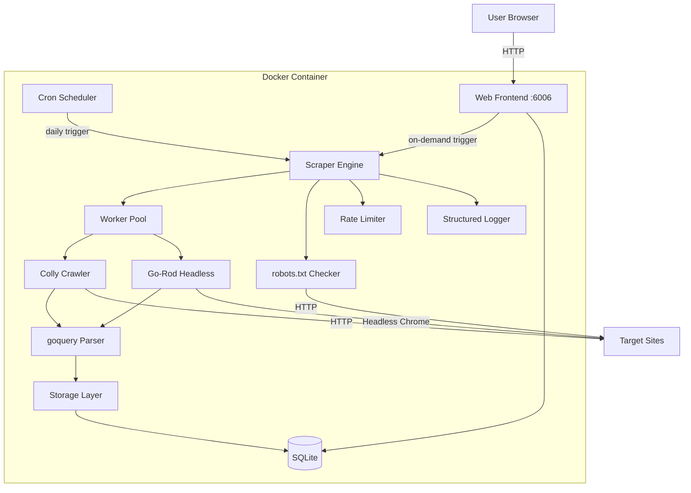
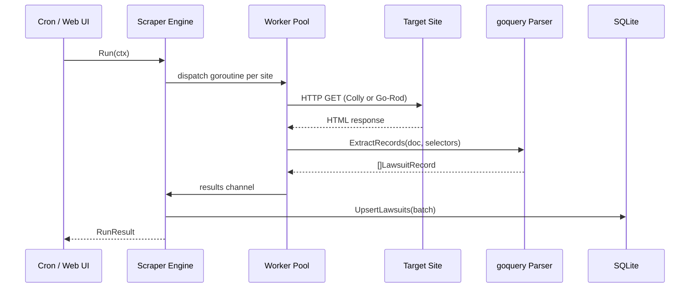
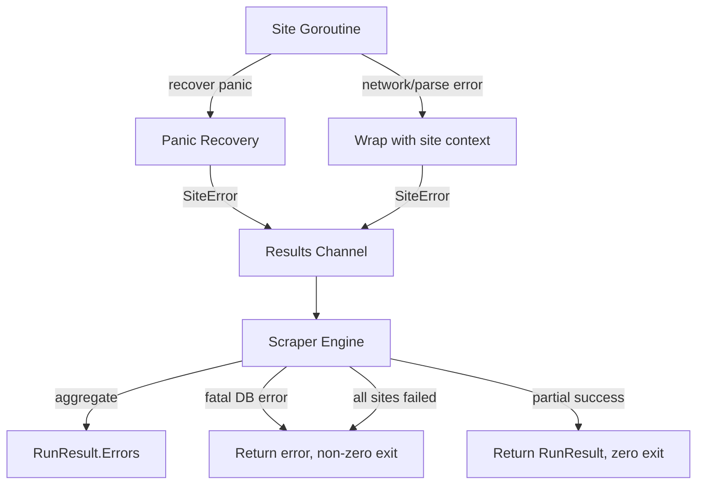

# Design Document: ClassAct — Class Action Scraper

## Overview

ClassAct is a Go application that discovers class action lawsuits from public websites, stores them in a local SQLite database, and exposes them through a local web frontend. The system runs daily inside a Docker container via cron, but also supports on-demand scraping from the UI.

The architecture is built around three pillars:

1. **Concurrent scraping engine** — Uses Colly for standard HTTP crawling and Go-Rod for JavaScript-heavy sites, with goroutine-based worker pools and channels for maximum throughput.
2. **Local data layer** — SQLite stores lawsuit records, application tracking status, and company filter lists. Deduplication is enforced via unique constraints on source URLs.
3. **Web frontend** — A local HTTP server serves a functional UI for browsing lawsuits, managing company filters, tracking applications, and triggering manual scrapes.

All scraping respects robots.txt, enforces rate limits, and uses a proper User-Agent string.

## Architecture



### Package Layout

```
classact/
├── cmd/
│   └── classact/          # main entrypoint
│       └── main.go
├── internal/
│   ├── config/            # constants file, site definitions
│   ├── scraper/           # scraping engine, worker pool, orchestration
│   ├── crawler/           # Colly-based crawling logic
│   ├── headless/          # Go-Rod headless browser fallback
│   ├── parser/            # goquery HTML parsing, field extraction
│   ├── compliance/        # robots.txt, rate limiter, User-Agent
│   ├── storage/           # SQLite repository, migrations
│   ├── model/             # shared data types (LawsuitRecord, etc.)
│   ├── web/               # HTTP handlers, templates, static assets
│   └── logging/           # structured JSON logger setup
├── Dockerfile
├── docker-compose.yml
├── go.mod
└── go.sum
```

### Key Design Decisions

| Decision | Rationale |
|---|---|
| Single binary, two modes | `classact scrape` for cron/CLI, `classact serve` for web frontend. Keeps deployment simple. |
| Colly + Go-Rod dual strategy | Colly is fast and lightweight for static HTML. Go-Rod handles JS-rendered content. Per-site flag in config controls which is used. |
| SQLite over Postgres | Local-only tool, no need for a server DB. SQLite is zero-config and Docker-volume-friendly. |
| Channel-based worker pool | Bounded concurrency via buffered channels prevents overwhelming target sites and respects rate limits. |
| `context.Context` everywhere | Enables cancellation, timeouts, and graceful shutdown across all I/O paths. |
| Structured JSON logging to stdout | Docker captures stdout natively. JSON format enables log parsing and filtering. |


## Components and Interfaces

### 1. Config (`internal/config`)

Holds the constants file and site definitions. This is the single place to add/remove target sites.

```go
// TargetSite defines a scraping target.
type TargetSite struct {
    Name           string
    URL            string
    UseHeadless    bool          // true = Go-Rod, false = Colly
    RateLimit      time.Duration // minimum delay between requests to this domain
    Selectors      SiteSelectors // CSS selectors for extracting fields
}

// SiteSelectors holds CSS selectors for goquery field extraction.
type SiteSelectors struct {
    ListingContainer string
    Title            string
    Description      string
    CompanyName      string
    FilingDate       string
    Deadline         string
    Status           string
    DetailLink       string
}

// Sites returns all configured target sites.
func Sites() []TargetSite
```

### 2. Scraper Engine (`internal/scraper`)

Orchestrates the full scraping run. Launches goroutines per site, manages the worker pool, and coordinates results.

```go
// Engine orchestrates a scraping run across all configured sites.
type Engine struct {
    store      storage.Repository
    logger     *slog.Logger
    maxWorkers int
}

// Run executes a full scraping cycle. Returns a RunResult summarizing the run.
// Respects ctx for cancellation/timeout.
func (e *Engine) Run(ctx context.Context) (*RunResult, error)

// RunResult captures metadata about a completed scraping run.
type RunResult struct {
    StartTime    time.Time
    EndTime      time.Time
    TotalFound   int
    NewRecords   int
    UpdatedRecords int
    Errors       []SiteError
}

// SiteError pairs a site name with the error encountered.
type SiteError struct {
    SiteName string
    URL      string
    Err      error
}
```

Internally, `Run` does:
1. Load sites from `config.Sites()`
2. Create a buffered channel (worker pool) sized to `maxWorkers`
3. Launch a goroutine per site, each acquiring a slot from the channel before making requests
4. Each goroutine delegates to either `crawler.Crawl` or `headless.Crawl` based on `UseHeadless`
5. Collected records are sent to a results channel
6. A consumer goroutine batches records and writes them to storage
7. Panics in goroutines are recovered, logged, and added to `RunResult.Errors`

### 3. Crawler (`internal/crawler`)

Colly-based crawling for standard HTML sites.

```go
// Crawl fetches and parses lawsuit listings from a target site using Colly.
// Returns parsed LawsuitRecords. Respects robots.txt and rate limits via the
// provided compliance.Policy.
func Crawl(ctx context.Context, site config.TargetSite, policy compliance.Policy) ([]model.LawsuitRecord, error)
```

### 4. Headless Browser (`internal/headless`)

Go-Rod fallback for JS-heavy sites.

```go
// Crawl renders a target site in a headless browser and extracts lawsuit records
// from the rendered DOM. Waits for DOM stability before extraction.
func Crawl(ctx context.Context, site config.TargetSite, policy compliance.Policy) ([]model.LawsuitRecord, error)
```

### 5. Parser (`internal/parser`)

Shared goquery-based extraction logic used by both crawler and headless modules.

```go
// ExtractRecords parses an HTML document using the provided selectors and returns
// a slice of LawsuitRecords. Works on both raw HTML (Colly) and rendered DOM (Go-Rod).
func ExtractRecords(doc *goquery.Document, site config.TargetSite) ([]model.LawsuitRecord, error)

// NormalizeCompanyName standardizes company name casing and whitespace for
// consistent filtering and deduplication.
func NormalizeCompanyName(name string) string
```

### 6. Compliance (`internal/compliance`)

Handles robots.txt parsing, rate limiting, and User-Agent management.

```go
// Policy encapsulates legal compliance rules for a target site.
type Policy struct {
    robotsData *robotstxt.RobotsData
    limiter    *rate.Limiter
    userAgent  string
}

// NewPolicy fetches robots.txt for the site and creates a rate limiter.
func NewPolicy(ctx context.Context, site config.TargetSite) (*Policy, error)

// IsAllowed checks if a URL path is permitted by robots.txt.
func (p *Policy) IsAllowed(path string) bool

// Wait blocks until the rate limiter allows the next request.
func (p *Policy) Wait(ctx context.Context) error

// UserAgent returns the configured User-Agent string.
func (p *Policy) UserAgent() string
```

### 7. Storage (`internal/storage`)

SQLite repository with auto-migration.

```go
// Repository defines the data access interface.
type Repository interface {
    // Lawsuit operations
    UpsertLawsuits(ctx context.Context, records []model.LawsuitRecord) (inserted int, updated int, err error)
    ListLawsuits(ctx context.Context, filter LawsuitFilter) ([]model.LawsuitRecord, error)
    
    // Application tracking
    MarkApplied(ctx context.Context, lawsuitID string) error
    GetAppliedStatus(ctx context.Context, lawsuitID string) (bool, error)
    
    // Company filter
    GetCompanyFilter(ctx context.Context) ([]string, error)
    AddCompany(ctx context.Context, name string) error
    RemoveCompany(ctx context.Context, name string) error
    
    // Run metadata
    SaveRunResult(ctx context.Context, result scraper.RunResult) error
    GetLatestRunResult(ctx context.Context) (*scraper.RunResult, error)
    
    Close() error
}

// LawsuitFilter specifies optional filtering criteria.
type LawsuitFilter struct {
    Companies []string // empty = no filter (return all)
}

// NewSQLiteRepository opens or creates the SQLite database and runs migrations.
func NewSQLiteRepository(dbPath string) (Repository, error)
```

### 8. Web Frontend (`internal/web`)

Local HTTP server with HTML templates. Functional over pretty.

```go
// Server is the local web frontend.
type Server struct {
    store   storage.Repository
    engine  *scraper.Engine
    logger  *slog.Logger
    scraping atomic.Bool // guards concurrent scrape triggers
}

// Routes:
// GET  /                    — Dashboard: lawsuit list, filters, run status
// POST /api/scrape          — Trigger on-demand scrape (async)
// GET  /api/scrape/status   — Poll scrape progress
// POST /api/applied/:id     — Mark lawsuit as applied
// GET  /api/companies       — List company filter
// POST /api/companies       — Add company to filter
// DELETE /api/companies/:name — Remove company from filter
// GET  /api/logs            — Recent scraping logs

func (s *Server) Start(ctx context.Context, addr string) error
```

The scrape button triggers a POST to `/api/scrape`. The server checks `scraping` atomically — if already running, returns 409 Conflict. Otherwise, launches the scrape in a goroutine and returns 202 Accepted. The frontend polls `/api/scrape/status` for progress.

### 9. Logging (`internal/logging`)

```go
// NewLogger creates a structured JSON logger writing to stdout.
func NewLogger() *slog.Logger
```

Uses Go's `log/slog` package with JSON handler. All components receive the logger via dependency injection.


## Data Models

### SQLite Schema

```sql
-- Lawsuit records
CREATE TABLE IF NOT EXISTS lawsuits (
    id          TEXT PRIMARY KEY,  -- UUID
    title       TEXT NOT NULL,
    description TEXT,
    source_url  TEXT NOT NULL UNIQUE,
    company     TEXT NOT NULL,
    filing_date TEXT,              -- ISO 8601 date
    deadline    TEXT,              -- ISO 8601 date
    status      TEXT NOT NULL DEFAULT 'open',
    applied     INTEGER NOT NULL DEFAULT 0,  -- 0 = not applied, 1 = applied
    applied_at  TEXT,              -- ISO 8601 timestamp, NULL if not applied
    created_at  TEXT NOT NULL DEFAULT (datetime('now')),
    updated_at  TEXT NOT NULL DEFAULT (datetime('now'))
);

CREATE UNIQUE INDEX IF NOT EXISTS idx_lawsuits_source_url ON lawsuits(source_url);
CREATE INDEX IF NOT EXISTS idx_lawsuits_company ON lawsuits(company);

-- Company filter list
CREATE TABLE IF NOT EXISTS company_filter (
    name       TEXT PRIMARY KEY,   -- normalized, lowercase
    created_at TEXT NOT NULL DEFAULT (datetime('now'))
);

-- Scraping run history
CREATE TABLE IF NOT EXISTS scrape_runs (
    id             TEXT PRIMARY KEY,  -- UUID
    start_time     TEXT NOT NULL,
    end_time       TEXT,
    total_found    INTEGER DEFAULT 0,
    new_records    INTEGER DEFAULT 0,
    updated_records INTEGER DEFAULT 0,
    errors         TEXT,              -- JSON array of SiteError
    created_at     TEXT NOT NULL DEFAULT (datetime('now'))
);
```

### Go Model Types (`internal/model`)

```go
// LawsuitRecord represents a single class action lawsuit.
type LawsuitRecord struct {
    ID          string
    Title       string
    Description string
    SourceURL   string
    Company     string
    FilingDate  *time.Time // nil if not available
    Deadline    *time.Time // nil if not available
    Status      string     // "open", "closed", "settled"
    Applied     bool
    AppliedAt   *time.Time
    CreatedAt   time.Time
    UpdatedAt   time.Time
}
```

### Data Flow




## Correctness Properties

*A property is a characteristic or behavior that should hold true across all valid executions of a system — essentially, a formal statement about what the system should do. Properties serve as the bridge between human-readable specifications and machine-verifiable correctness guarantees.*

### Property 1: Config structure validity

*For any* TargetSite returned by `config.Sites()`, the site must have a non-empty Name, a valid URL, a valid RateLimit duration, non-empty CSS selectors, and a defined UseHeadless boolean flag.

**Validates: Requirements 1.1, 10.1**

### Property 2: All configured sites are attempted

*For any* set of TargetSites returned by `config.Sites()`, after a scraping run completes, every site in the set should have been attempted (either successfully crawled or recorded as an error in RunResult).

**Validates: Requirements 2.1**

### Property 3: HTML parsing extracts all required fields (round trip)

*For any* valid HTML document containing lawsuit data matching the configured CSS selectors, `ExtractRecords` should return LawsuitRecords where each record has a non-empty Title, SourceURL, and Company. Storing and retrieving these records from the database should preserve all field values.

**Validates: Requirements 2.2, 8.2**

### Property 4: Upsert idempotency

*For any* LawsuitRecord, upserting it into the database N times (N >= 1) should result in exactly one record with that source URL in the database. The record's fields should reflect the most recent upsert.

**Validates: Requirements 2.3, 8.3**

### Property 5: Fault tolerance across sites

*For any* set of TargetSites where one or more sites fail (HTTP error, panic, or headless browser failure), the scraper should still attempt all remaining sites and return results for the successful ones. Failed sites should appear in `RunResult.Errors`.

**Validates: Requirements 2.4, 7.5, 10.5**

### Property 6: robots.txt compliance

*For any* robots.txt content and any URL path, `Policy.IsAllowed(path)` should return `false` for paths disallowed by the robots.txt rules and `true` for allowed paths. The scraper should never request a disallowed path.

**Validates: Requirements 3.1**

### Property 7: Rate limiting applies uniformly

*For any* sequence of N requests to the same domain (regardless of whether Colly or Go-Rod is used), the elapsed time between the first and last request should be at least `(N-1) * rateLimit`.

**Validates: Requirements 3.2, 10.6**

### Property 8: User-Agent is set on all requests

*For any* HTTP request made by the scraper (Colly or Go-Rod), the User-Agent header should be set to a non-empty string that identifies the application.

**Validates: Requirements 3.3**

### Property 9: Exit code correctness

*For any* scraping run that completes without fatal errors, the process should return a nil error (zero exit code). *For any* scraping run that encounters a fatal error, the process should return a non-nil error (non-zero exit code).

**Validates: Requirements 4.4, 4.5**

### Property 10: Mark-as-applied round trip with idempotency

*For any* LawsuitRecord stored in the database, calling `MarkApplied` should set `Applied=true` and `AppliedAt` to a non-nil timestamp. Calling `MarkApplied` a second time on the same record should not change the `AppliedAt` timestamp. Listing records should correctly reflect the applied status.

**Validates: Requirements 5.1, 5.2, 5.3, 5.4, 11.4**

### Property 11: Company filter round trip

*For any* list of company names, adding each name to the company filter and then calling `GetCompanyFilter` should return a set containing all added names. Removing a name and calling `GetCompanyFilter` should return a set without that name.

**Validates: Requirements 6.1, 6.4, 6.5**

### Property 12: Company filter matching

*For any* set of LawsuitRecords in the database and any non-empty company filter list, `ListLawsuits` with that filter should return only records whose company name matches (case-insensitive) an entry in the filter. *For any* empty filter list, `ListLawsuits` should return all records.

**Validates: Requirements 6.2, 6.3, 11.3**

### Property 13: Context cancellation propagation

*For any* in-progress scraping operation or database operation, cancelling the associated `context.Context` should cause the operation to return within a bounded time with a context cancellation error.

**Validates: Requirements 7.4**

### Property 14: Structured JSON logging

*For any* scraping run, all log entries written to stdout should be valid JSON. Run-summary log entries should contain fields for start time, end time, total found, and duration. Error log entries should contain fields for site name, URL, and error message.

**Validates: Requirements 9.1, 9.2, 9.4**

### Property 15: Crawl strategy dispatch

*For any* TargetSite with `UseHeadless=true`, the scraper should delegate to the headless (Go-Rod) module. *For any* TargetSite with `UseHeadless=false`, the scraper should delegate to the Colly-based crawler module.

**Validates: Requirements 10.2, 10.3**

### Property 16: Web frontend lists all records and run status

*For any* set of LawsuitRecords in the database, the web frontend's listing endpoint should return all records with their complete fields. The run status endpoint should return the most recent RunResult.

**Validates: Requirements 11.2, 11.6**

### Property 17: Scrape trigger mutual exclusion

*For any* POST to `/api/scrape` when no scrape is running, the server should return 202 Accepted and start the scrape asynchronously. *For any* POST to `/api/scrape` while a scrape is already in progress, the server should return 409 Conflict without starting a second scrape.

**Validates: Requirements 11.10, 11.11**


## Error Handling

### Error Categories

| Category | Examples | Strategy |
|---|---|---|
| Network errors | DNS failure, connection timeout, HTTP 4xx/5xx | Log with site context, skip site, continue remaining sites |
| Parse errors | Missing CSS selector match, malformed HTML, unexpected page structure | Log with URL and selector details, skip record, continue parsing |
| Database errors | SQLite lock contention, disk full, migration failure | Retry with backoff for transient errors (lock), fatal exit for persistent errors (disk full) |
| Headless browser errors | Chrome launch failure, page render timeout, DOM never stabilizes | Log with site context, skip site, continue remaining sites |
| Panic recovery | Nil pointer in parser, index out of range | Recover in goroutine, log stack trace, record in RunResult.Errors, continue |
| robots.txt errors | Fetch failure, malformed robots.txt | Conservative default: if robots.txt can't be fetched/parsed, skip the site entirely and log |
| Context cancellation | User-initiated cancel, timeout exceeded | Return immediately with context error, partial results are discarded |

### Error Propagation



### Error Design Principles

1. **Never crash the whole run for a single site failure.** Each site runs in its own goroutine with panic recovery. Errors are collected, not propagated.
2. **Wrap errors with context.** Every error includes the site name and URL so log consumers can identify the source without guessing.
3. **Conservative robots.txt handling.** If we can't determine what's allowed, we don't crawl. Legal safety over data completeness.
4. **Structured error logging.** All errors are logged as JSON with consistent fields (`site`, `url`, `error`, `component`).
5. **Idempotent retries.** Upsert semantics mean a re-run after partial failure safely picks up where it left off without duplicating data.

## Testing Strategy

### Testing Framework

- **Unit tests**: Go's standard `testing` package with table-driven tests (per project standards)
- **Property-based tests**: [rapid](https://github.com/flyingmutant/rapid) — a Go property-based testing library
- **HTTP mocking**: `net/http/httptest` for mock servers
- **Database tests**: In-memory SQLite (`:memory:`) for fast, isolated storage tests

### Property-Based Testing Configuration

- Each property test runs a minimum of **100 iterations**
- Each property test is tagged with a comment referencing the design property:
  ```go
  // Feature: class-action-scraper, Property 4: Upsert idempotency
  ```
- Each correctness property is implemented by a **single** property-based test function
- Generators produce random TargetSites, LawsuitRecords, company names, HTML documents, and robots.txt content

### Test Plan

#### Property Tests (one per correctness property)

| Property | Test Description | Key Generators |
|---|---|---|
| 1: Config structure validity | Generate random site configs, validate all required fields are present and valid | Random strings, URLs, durations, booleans |
| 2: All configured sites attempted | Generate N mock sites, run engine, verify all N appear in results or errors | Random site lists with mock HTTP servers |
| 3: HTML parsing round trip | Generate HTML with known lawsuit data, parse, store, retrieve, compare | Random lawsuit fields embedded in HTML templates |
| 4: Upsert idempotency | Generate random records, upsert 1-5 times each, verify exactly one record per source URL | Random LawsuitRecords with random repeat counts |
| 5: Fault tolerance | Generate N sites where K randomly fail, verify remaining N-K succeed | Random failure injection (HTTP errors, panics) |
| 6: robots.txt compliance | Generate random robots.txt rules and paths, verify IsAllowed matches expected | Random disallow rules, random URL paths |
| 7: Rate limiting | Generate N requests, measure timing, verify minimum elapsed time | Random request counts (2-20) |
| 8: User-Agent header | Generate requests via mock server, capture and verify User-Agent | Random site configs |
| 9: Exit code correctness | Generate runs with/without fatal errors, verify return value | Random error injection |
| 10: Mark-as-applied round trip | Generate random records, mark applied 1-3 times, verify status and timestamp stability | Random LawsuitRecords, random repeat counts |
| 11: Company filter round trip | Generate random company names, add/remove sequences, verify final state | Random strings, random add/remove sequences |
| 12: Company filter matching | Generate random records and filter lists, verify filtered results match only filter entries (case-insensitive) | Random LawsuitRecords, random company name lists with mixed casing |
| 13: Context cancellation | Generate operations with cancelled contexts, verify timely return | Random operation types, immediate cancellation |
| 14: Structured JSON logging | Generate scraping runs, capture stdout, parse each line as JSON, verify required fields | Random run scenarios |
| 15: Crawl strategy dispatch | Generate sites with random UseHeadless flags, verify correct module is called | Random booleans, mock crawl modules |
| 16: Web frontend listing | Generate random DB contents, query listing endpoint, verify all records returned | Random LawsuitRecord sets |
| 17: Scrape trigger mutual exclusion | Trigger concurrent scrape requests, verify exactly one 202 and rest are 409 | Random concurrent request counts (2-10) |

#### Unit Tests (specific examples and edge cases)

| Area | Test Cases |
|---|---|
| Config | Known three sites exist (1.2); empty selectors rejected |
| Parser | Empty HTML returns zero records; HTML with missing fields produces partial records; malformed HTML doesn't panic |
| Storage | Auto-migration on fresh DB (8.4); empty DB returns empty list (11.8); applied_at timestamp format |
| Company filter | Empty filter returns all records (6.3); single-character company names; Unicode company names |
| Web frontend | Server starts on configured port (11.1); scrape button exists (11.9); logs endpoint returns data (11.7); company management UI (11.5) |
| Compliance | Malformed robots.txt defaults to disallow; zero-length rate limit rejected |
| Headless | DOM stability timeout handling (10.4) |

### Test Organization

```
classact/
├── internal/
│   ├── config/
│   │   └── config_test.go        # Property 1 + unit tests
│   ├── scraper/
│   │   └── engine_test.go        # Properties 2, 5, 9, 13, 15
│   ├── parser/
│   │   └── parser_test.go        # Property 3
│   ├── compliance/
│   │   └── compliance_test.go    # Properties 6, 7, 8
│   ├── storage/
│   │   └── storage_test.go       # Properties 4, 10, 11, 12
│   └── web/
│       └── web_test.go           # Properties 16, 17 + unit tests
```

### CI Integration

- `go test ./...` runs all unit and property tests
- `go vet`, `staticcheck`, and `golangci-lint` run on every commit (per project standards)
- Property tests use `rapid.Check` with default 100 iterations; CI can increase via `-rapid.checks=1000`
